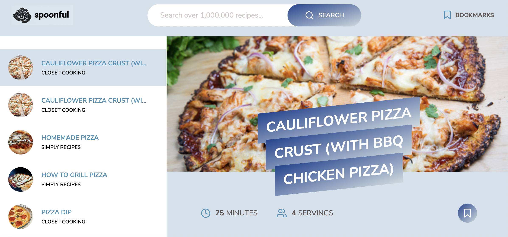

# SPOONFUL


<!-- PROJECT LOGO -->
<br />
<div >
    
  </a>


  <p>
    <a href="https://spoonful-recipe.netlify.app">View Demo</a>
  </p>
</div>


<!-- ABOUT THE PROJECT -->
## About The Project
<br />


Modern Recipe Web App allows users to search and bookmark thousands of recipes. Each recipe is rendered with helpful details such as portion, cooking time, ingredients and the external link to the offical website. 
This app uses modern JavaScript tools, such as Webpack to bundle the modules, and Babel to convert ES6, ES7 and ES8 back to ES5.

### Built With
- [HTML](https://developer.mozilla.org/en-US/docs/Web/HTML)
- [SCSS](https://sass-lang.com/)
- [JavaScript](https://developer.mozilla.org/en-US/docs/Web/javascript)
- [Webpack](https://webpack.js.org/)
- [NPM](https://www.npmjs.com/)


<p align="right">(<a href="#readme-top">back to top</a>)</p>


<!-- GETTING STARTED -->
## Getting Started

This is an example of how you may give instructions on setting up your project locally.
To get a local copy up and running follow these simple example steps.

### Prerequisites

This is an example of how to list things you need to use the software and how to install them.
* npm
  ```sh
  npm install npm@latest -g
  ```


### Installation

1. Get a free API Key [HERE](https://forkify-api.herokuapp.com/v2)
2. Clone the repo
   ```sh
   git clone https://github.com/trucn0311/spoonful.git
   ```
3. Install NPM packages
   ```sh
   npm install
   ```
4. Enter your API in `config.js`
   ```JS
   const KEY = 'ENTER YOUR API';
   ```
5. Start the project
   ```sh
   npm start
   ```


<!-- CONTACT -->
## Contact

Tiffany Nguyen - [@linkedin](https://www.linkedin.com/in/truc-nguyen-480222230/) - trucn0311@gmail.com

Project Link: 


